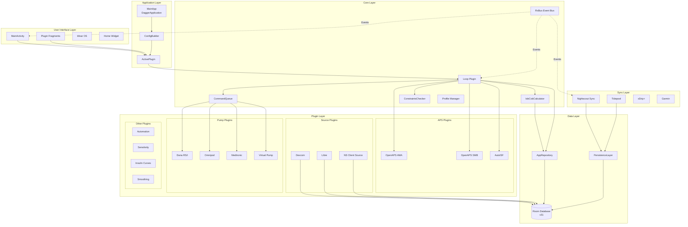
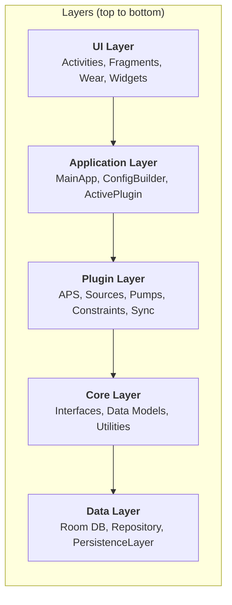
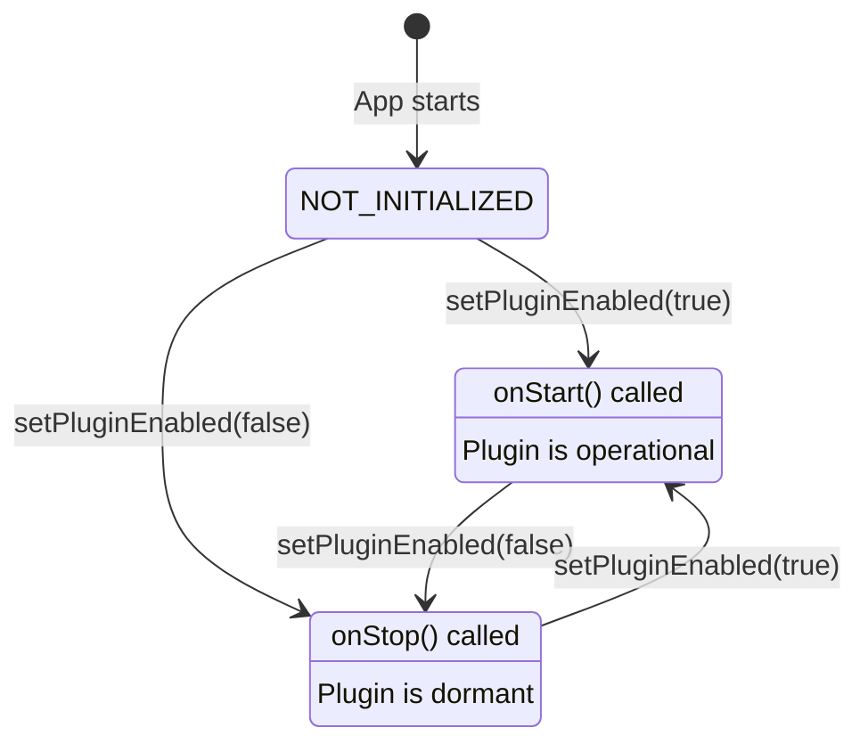
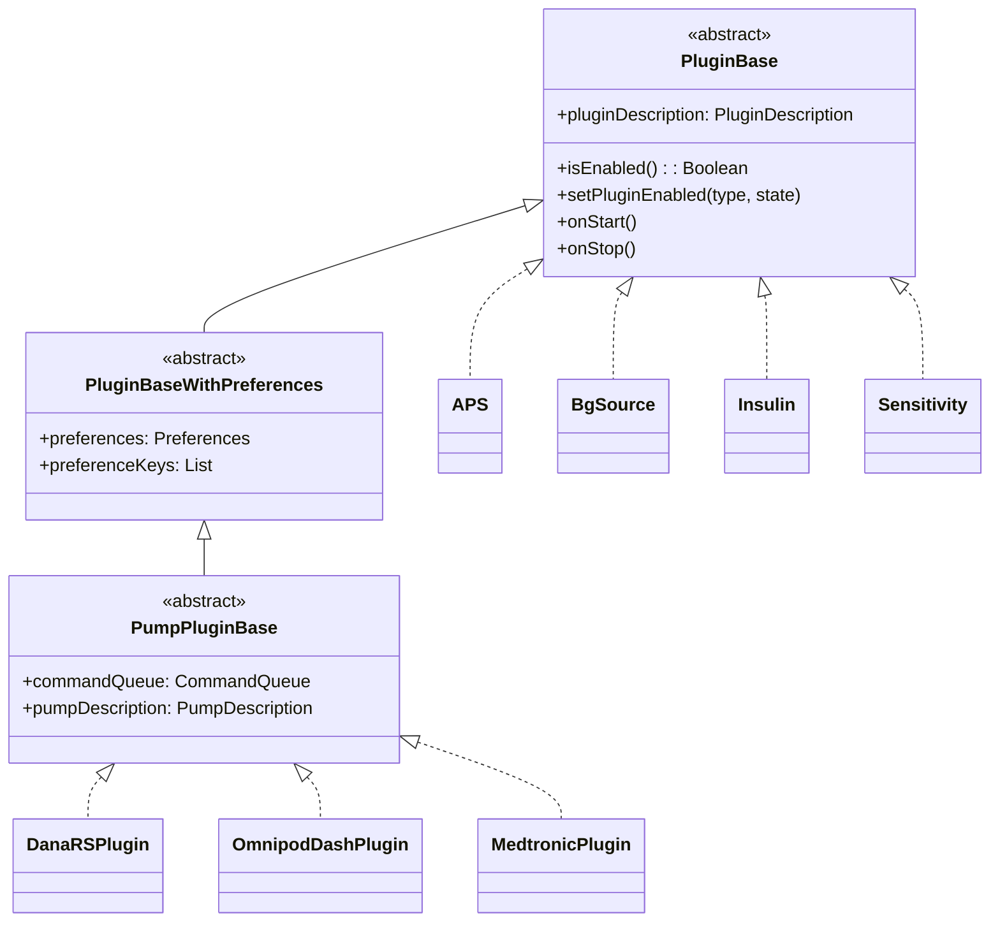
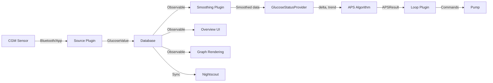
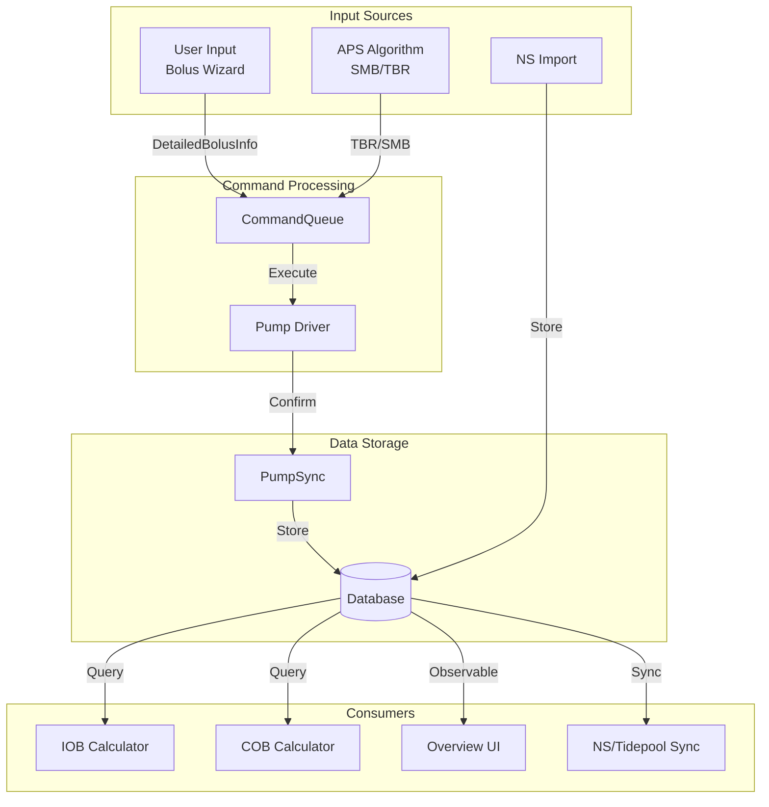
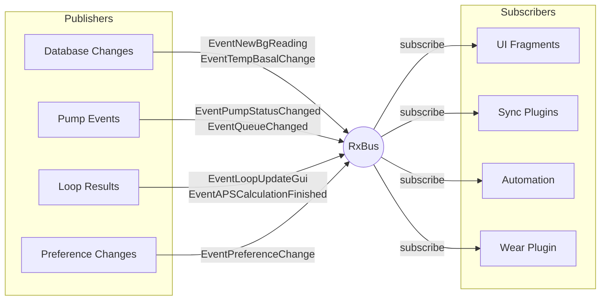
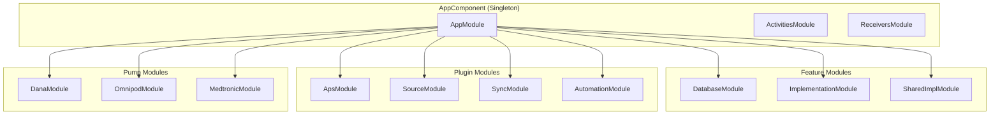
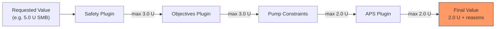

# AndroidAPS Architecture

> **AndroidAPS** is an open-source artificial pancreas system (APS) for Android devices. It reads continuous glucose monitor (CGM) data, runs a control algorithm, and commands an insulin pump to automate insulin delivery for people with Type 1 diabetes.

## Table of Contents

- [High-Level Overview](#high-level-overview)
- [System Architecture Diagram](#system-architecture-diagram)
- [Core Design Principles](#core-design-principles)
- [Layered Architecture](#layered-architecture)
- [Plugin System](#plugin-system)
- [Closed-Loop Algorithm Flow](#closed-loop-algorithm-flow)
- [Data Flow](#data-flow)
- [Event-Driven Communication](#event-driven-communication)
- [Dependency Injection](#dependency-injection)
- [Constraint System](#constraint-system)
- [Build System](#build-system)

---

## High-Level Overview

AndroidAPS connects three physical components through software:

```
┌─────────────┐      ┌──────────────┐      ┌──────────────┐
│  CGM Sensor  │─────▶│  AndroidAPS  │─────▶│  Insulin     │
│  (Dexcom,    │ BG   │  (Android    │ Cmds │  Pump        │
│   Libre...)  │ data │   Phone)     │      │  (Dana, Omni │
└─────────────┘      └──────────────┘      │   pod, etc.) │
                            │               └──────────────┘
                            │
                     ┌──────▼──────┐
                     │  Cloud Sync  │
                     │  (Nightscout,│
                     │   Tidepool)  │
                     └─────────────┘
```

## System Architecture Diagram



## Core Design Principles

| Principle | Implementation |
|-----------|---------------|
| **Modularity** | 49 Gradle modules with clear boundaries |
| **Plugin Architecture** | All major features are swappable plugins |
| **Safety First** | Multi-layer constraint system limits all insulin delivery |
| **Reactive** | RxJava3 event bus for decoupled communication |
| **Offline-First** | Room database as single source of truth |
| **Testability** | Interface-driven design with Dagger DI |

## Layered Architecture



### Layer Responsibilities

**UI Layer** (`/app`, `/ui`, `/wear`)
- Activities and Fragments for user interaction
- Wear OS companion app
- Home screen widget
- No business logic — delegates to plugins

**Application Layer** (`/app`)
- `MainApp` bootstraps Dagger, Firebase, and plugin lifecycle
- `ConfigBuilder` manages plugin selection and initialization
- `ActivePlugin` provides access to currently selected plugin instances

**Plugin Layer** (`/plugins`, `/pump`)
- Self-contained features implementing core interfaces
- Each plugin has its own Dagger module, preferences, and optional UI fragment
- 10 plugin types: APS, Pump, Source, Insulin, Sensitivity, Constraints, Sync, Automation, Smoothing, Configuration

**Core Layer** (`/core`, `/implementation`)
- Interface contracts (`/core/interfaces`)
- Data models (`/core/data`)
- Shared utilities (`/core/utils`)
- Preference key definitions (`/core/keys`)
- Graph rendering (`/core/graph`)

**Data Layer** (`/database`)
- Room database with 20+ entities
- Repository pattern with reactive queries (RxJava3)
- Transaction system for atomic operations
- Migration support (version 20 → 31)

## Plugin System

### Plugin Lifecycle



### Plugin Type Hierarchy



### Plugin Types

| Type | Purpose | Examples |
|------|---------|---------|
| `APS` | Closed-loop algorithm | OpenAPS SMB, AMA, AutoISF |
| `PUMP` | Insulin pump driver | Dana RS, Omnipod Dash, Medtronic |
| `BGSOURCE` | CGM data source | Dexcom, Libre, NSClient |
| `INSULIN` | Insulin absorption curves | Rapid-Acting, Ultra-Rapid, Lyumjev |
| `SENSITIVITY` | Autosens algorithms | Oref1, AAPS, Weighted Average |
| `CONSTRAINTS` | Safety limits | Safety, Objectives |
| `SYNC` | Cloud synchronization | Nightscout, Tidepool, xDrip+ |
| `AUTOMATION` | Rule-based actions | Automation engine |
| `SMOOTHING` | BG data smoothing | Average, Exponential |
| `LOOP` | Loop coordinator | LoopPlugin |

## Closed-Loop Algorithm Flow

```mermaid
sequenceDiagram
    participant CGM as CGM Sensor
    participant DB as Database
    participant Bus as RxBus
    participant Loop as LoopPlugin
    participant APS as APS Algorithm
    participant IOB as IobCobCalculator
    participant CC as ConstraintsChecker
    participant CQ as CommandQueue
    participant Pump as Pump Driver

    CGM->>DB: Store GlucoseValue
    DB->>Bus: EventNewBgReading
    Bus->>Loop: Trigger invoke()

    Note over Loop: Validate preconditions:<br/>Mode != DISABLED<br/>Profile loaded<br/>Pump ready<br/>Queue not busy

    Loop->>APS: invoke(initiator, tempBasalFallback)
    APS->>IOB: calculateFromTreatmentsAndTemps()
    APS->>IOB: getCobInfo()
    APS->>IOB: getMealData()
    IOB-->>APS: IobTotal, CobInfo, MealData

    Note over APS: DetermineBasal algorithm:<br/>Calculate target rate<br/>Calculate SMB amount<br/>Generate predictions

    APS-->>Loop: APSResult (rate, SMB, predictions)

    Loop->>CC: applyBasalConstraints(rate)
    Loop->>CC: applyBolusConstraints(smb)
    CC-->>Loop: Constrained values + reasons

    alt Closed Loop Mode
        Loop->>CQ: tempBasalAbsolute(rate)
        CQ->>Pump: setTempBasalAbsolute()
        Pump-->>CQ: PumpEnactResult
        CQ-->>Loop: TBR success

        opt SMB Requested
            Loop->>CQ: bolus(smbAmount)
            CQ->>Pump: deliverTreatment()
            Pump-->>CQ: PumpEnactResult
        end
    else Open Loop Mode
        Loop->>Bus: EventNewOpenLoopNotification
        Note over Bus: User must approve
    end

    Loop->>DB: Store APSResult
    Loop->>Bus: EventLoopUpdateGui
```

### Algorithm Steps (DetermineBasal)

1. **Read current glucose** — latest GV + delta + trend
2. **Calculate IOB** — insulin on board from boluses + temp basals
3. **Calculate COB** — carbs on board from meal entries
4. **Run autosensitivity** — adjust ISF/CR based on recent data
5. **Determine target** — apply temp targets if active
6. **Calculate eventual BG** — predict where BG is heading
7. **Set temp basal rate** — increase/decrease basal to reach target
8. **Calculate SMB** — optional micro-bolus for faster correction
9. **Apply safety constraints** — max IOB, max basal, max SMB limits

## Data Flow

### Blood Glucose Data Pipeline



### Treatment Data Flow



## Event-Driven Communication

AndroidAPS uses an **RxBus** (publish-subscribe event bus built on RxJava3) for decoupled communication between components.



### Key Events

| Event | Trigger | Consumers |
|-------|---------|-----------|
| `EventNewBgReading` | New CGM value stored | Loop, Overview |
| `EventTempBasalChange` | TBR started/stopped | Overview, NS Sync |
| `EventLoopUpdateGui` | Loop cycle complete | Overview UI |
| `EventAPSCalculationFinished` | APS result ready | Loop, Overview |
| `EventQueueChanged` | Command queue update | Overview status |
| `EventPreferenceChange` | Setting changed | All plugins |
| `EventAppExit` | App shutting down | All plugins |

## Dependency Injection

AndroidAPS uses **Dagger 2** with `dagger.android` for dependency injection across 49 modules.



### Key Bindings

- `ActivePlugin` — resolves to currently selected plugin for each type
- `CommandQueue` — singleton serializing pump commands
- `AppRepository` — singleton database access
- `RxBus` — singleton event bus
- `Preferences` — type-safe preference access
- `ResourceHelper` — string/resource resolution

## Constraint System

The constraint system is a **chain-of-responsibility** pattern where every enabled plugin implementing `PluginConstraints` can restrict insulin delivery values.



### Constraint Types

- **Boolean constraints**: Is loop allowed? Is SMB allowed? Is closed loop allowed?
- **Value constraints**: Max basal rate, max bolus, max IOB, max carbs
- **Each constraint carries reasons**: Human-readable explanations of why a value was limited

## Build System

- **Gradle 8.13** with Kotlin DSL and KSP annotation processing
- **49 modules** included in `settings.gradle`
- **Centralized versions** in `gradle/libs.versions.toml`
- **Product flavors**: `full`, `pumpcontrol`, `aapsclient`, `aapsclient2`
- **Target**: compileSdk 36, minSdk 31, Java 21
- **Key dependencies**: Dagger 2.57, Room 2.8, RxJava3, Retrofit 3, OkHttp 5, Kotlin 2.2
