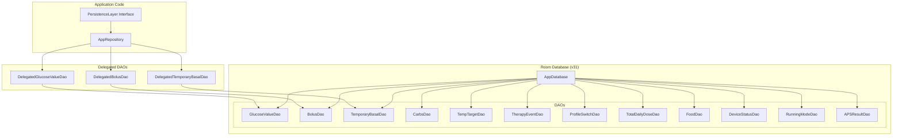
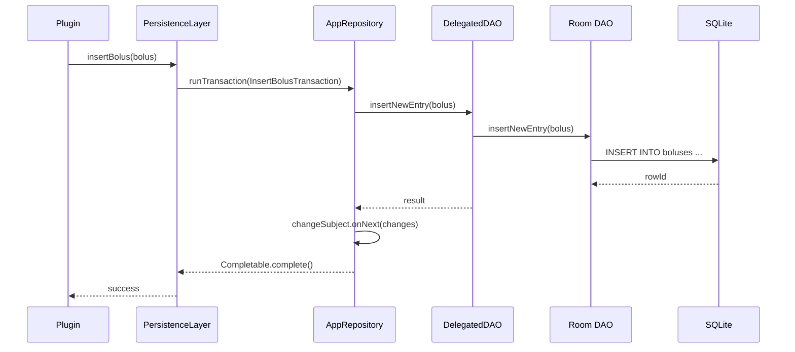
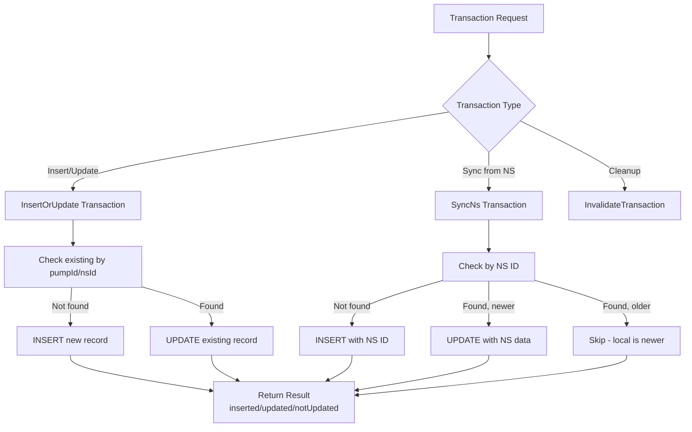
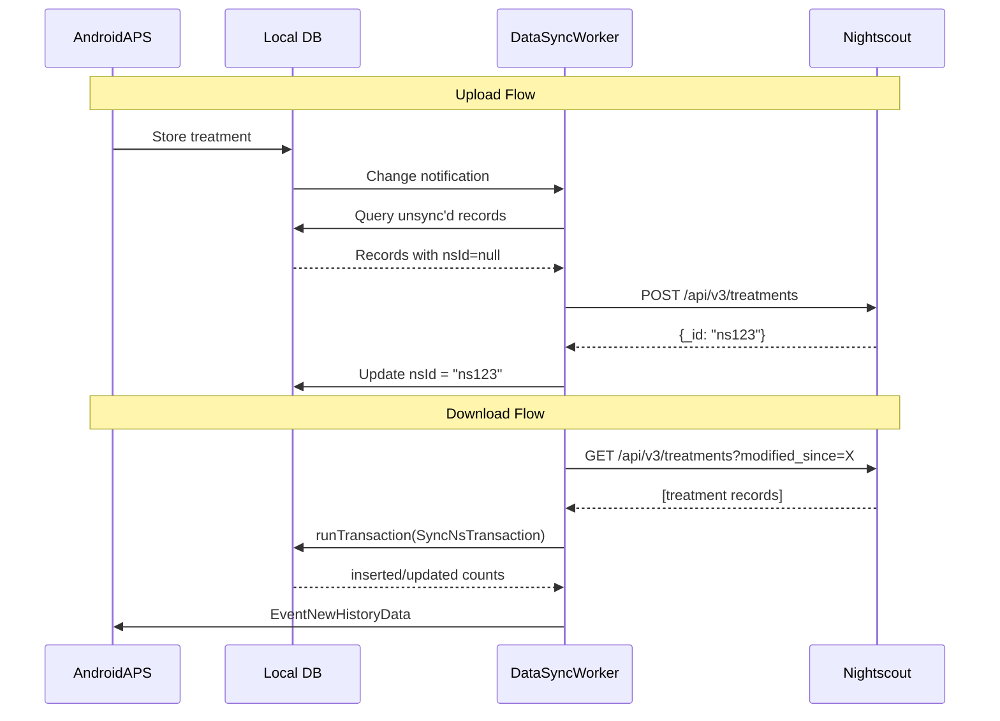

# AndroidAPS Database Architecture

> The persistence layer uses Android Room (SQLite) with a reactive repository pattern built on RxJava3.

## Table of Contents

- [Overview](#overview)
- [Entity-Relationship Diagram](#entity-relationship-diagram)
- [Entities](#entities)
- [Repository Pattern](#repository-pattern)
- [Transaction System](#transaction-system)
- [Data Sync Flow](#data-sync-flow)
- [Migration Strategy](#migration-strategy)

---

## Overview



## Entity-Relationship Diagram

```mermaid
erDiagram
    GlucoseValue {
        long id PK
        long timestamp
        double value
        string trendArrow
        double raw
        int noise
        string sourceSensor
        long interfaceIDs_nightscoutId
        boolean isValid
    }

    Bolus {
        long id PK
        long timestamp
        double amount
        string type
        boolean isBasalInsulin
        long interfaceIDs_nightscoutId
        long interfaceIDs_pumpId
        long interfaceIDs_pumpSerial
        boolean isValid
    }

    TemporaryBasal {
        long id PK
        long timestamp
        long duration
        double rate
        int type
        long interfaceIDs_nightscoutId
        long interfaceIDs_pumpId
        boolean isValid
    }

    Carbs {
        long id PK
        long timestamp
        double amount
        long duration
        long interfaceIDs_nightscoutId
        boolean isValid
    }

    TemporaryTarget {
        long id PK
        long timestamp
        long duration
        double lowTarget
        double highTarget
        int reason
        long interfaceIDs_nightscoutId
        boolean isValid
    }

    TherapyEvent {
        long id PK
        long timestamp
        long duration
        string type
        string note
        double glucose
        string glucoseUnit
        long interfaceIDs_nightscoutId
        boolean isValid
    }

    ProfileSwitch {
        long id PK
        long timestamp
        long duration
        string profileName
        string profileJson
        int percentage
        int timeShift
        long interfaceIDs_nightscoutId
        boolean isValid
    }

    EffectiveProfileSwitch {
        long id PK
        long timestamp
        long duration
        string profileJson
        string originalProfileName
        long interfaceIDs_nightscoutId
        boolean isValid
    }

    TotalDailyDose {
        long id PK
        long timestamp
        double basalAmount
        double bolusAmount
        double totalAmount
        double carbsAmount
        long interfaceIDs_pumpId
        boolean isValid
    }

    Food {
        long id PK
        string name
        string category
        string subCategory
        double carbs
        double fat
        double protein
        double energy
        string unit
        int portion
        long interfaceIDs_nightscoutId
        boolean isValid
    }

    DeviceStatus {
        long id PK
        long timestamp
        string device
        string pump
        string enacted
        string iob
        string suggested
        long interfaceIDs_nightscoutId
    }

    RunningMode {
        long id PK
        long timestamp
        int mode
        long interfaceIDs_nightscoutId
    }

    APSResult {
        long id PK
        long timestamp
        int algorithm
        string resultJson
        long glucoseStatusJson
        long iobDataJson
    }

    UserEntry {
        long id PK
        long timestamp
        int action
        int source
        string note
        string values
    }

    GlucoseValue ||--o{ APSResult : "feeds into"
    Bolus ||--o{ TotalDailyDose : "aggregated in"
    TemporaryBasal ||--o{ TotalDailyDose : "aggregated in"
    ProfileSwitch ||--|| EffectiveProfileSwitch : "resolves to"
```



## Entities

### Treatment Entities

| Entity | Table | Key Fields | Description |
|--------|-------|------------|-------------|
| `GlucoseValue` | `glucoseValues` | timestamp, value, trendArrow | CGM readings |
| `Bolus` | `boluses` | timestamp, amount, type | Insulin boluses (NORMAL, SMB, PRIMING) |
| `TemporaryBasal` | `temporaryBasals` | timestamp, duration, rate, type | Temp basal rates |
| `ExtendedBolus` | `extendedBoluses` | timestamp, duration, amount | Extended/square wave boluses |
| `Carbs` | `carbs` | timestamp, amount, duration | Carbohydrate entries |
| `TemporaryTarget` | `temporaryTargets` | timestamp, duration, low/highTarget | Temp BG targets |
| `TherapyEvent` | `therapyEvents` | timestamp, type, note | Sensor changes, site changes, etc. |

### Profile Entities

| Entity | Table | Description |
|--------|-------|-------------|
| `ProfileSwitch` | `profileSwitches` | User-initiated profile changes |
| `EffectiveProfileSwitch` | `effectiveProfileSwitches` | Resolved profiles after switches |

### Status Entities

| Entity | Table | Description |
|--------|-------|-------------|
| `DeviceStatus` | `deviceStatus` | Pump/loop status snapshots for NS |
| `RunningMode` | `runningModes` | Loop mode changes (open/closed/LGS) |
| `APSResult` | `apsResults` | Algorithm output storage |
| `TotalDailyDose` | `totalDailyDoses` | Daily insulin aggregations |

### Reference Entities

| Entity | Table | Description |
|--------|-------|-------------|
| `Food` | `foods` | Food database for carb lookup |
| `UserEntry` | `userEntries` | Audit trail of user actions |
| `PreferenceChange` | `preferenceChanges` | Setting change history |
| `VersionChange` | `versionChanges` | App version tracking |
| `HeartRate` | `heartRates` | Heart rate data from wearables |
| `StepsCount` | `stepsCounts` | Step counter data |

## Repository Pattern

The `AppRepository` wraps all DAO access with:

- **RxJava3 reactive queries** — `Observable`, `Single`, `Maybe`, `Completable`
- **Change notifications** — `PublishSubject` emits on every write
- **Thread management** — all queries on `Schedulers.io()`
- **Transaction support** — atomic multi-step operations



### Reactive Change Tracking

```kotlin
// Subscribe to bolus changes
appRepository.changeObservable()
    .filter { it.filterBolus() }
    .observeOn(aapsSchedulers.main)
    .subscribe { updateBolusUI() }
```

## Transaction System

Database writes use a transaction pattern for atomicity:



### Transaction Result Types

- `inserted` — new records created
- `updated` — existing records modified
- `invalidated` — records marked as invalid (soft delete)
- `ended` — timed records (TBR, TT) marked as finished

## Data Sync Flow



### Interface IDs

Every entity has `InterfaceIDs` for cross-system identification:

| Field | Purpose |
|-------|---------|
| `nightscoutSystemId` | Nightscout `_id` |
| `nightscoutId` | Nightscout slug ID |
| `pumpType` | Source pump type |
| `pumpSerial` | Source pump serial number |
| `pumpId` | Pump-assigned record ID |
| `startId` / `endId` | Pump history range |

## Migration Strategy

- **Incremental migrations** from version 20 to 31
- Each migration is a named class (e.g., `Migration24to25`)
- Migrations handle:
  - New table creation
  - Column additions
  - Index modifications
  - Data transformations
- **No destructive fallback** — data safety is critical for medical device
