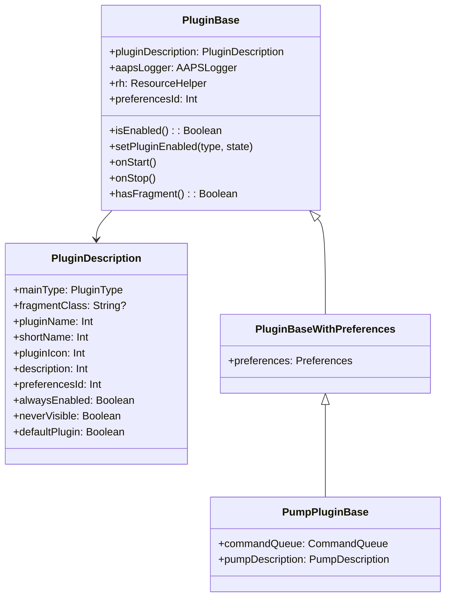
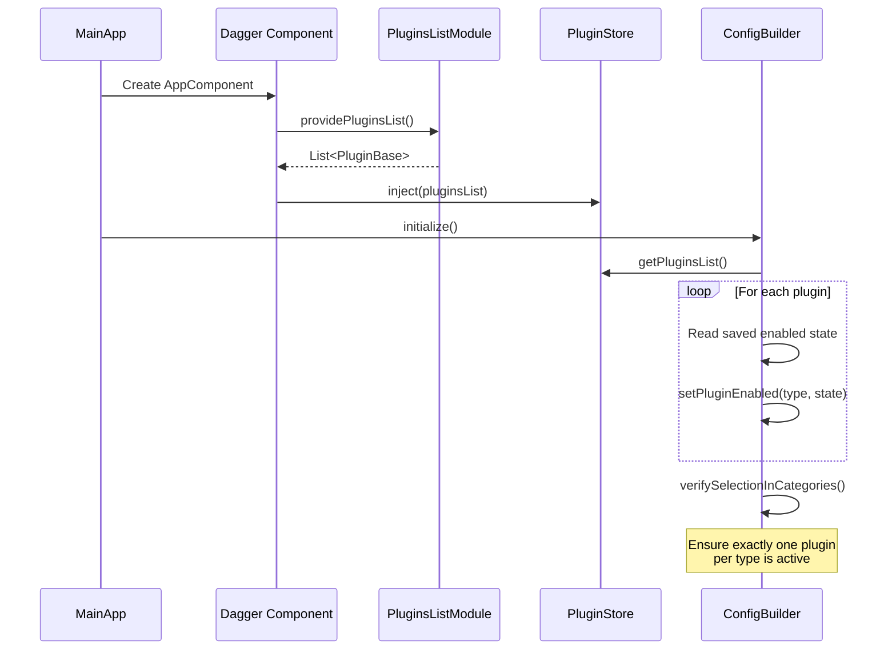
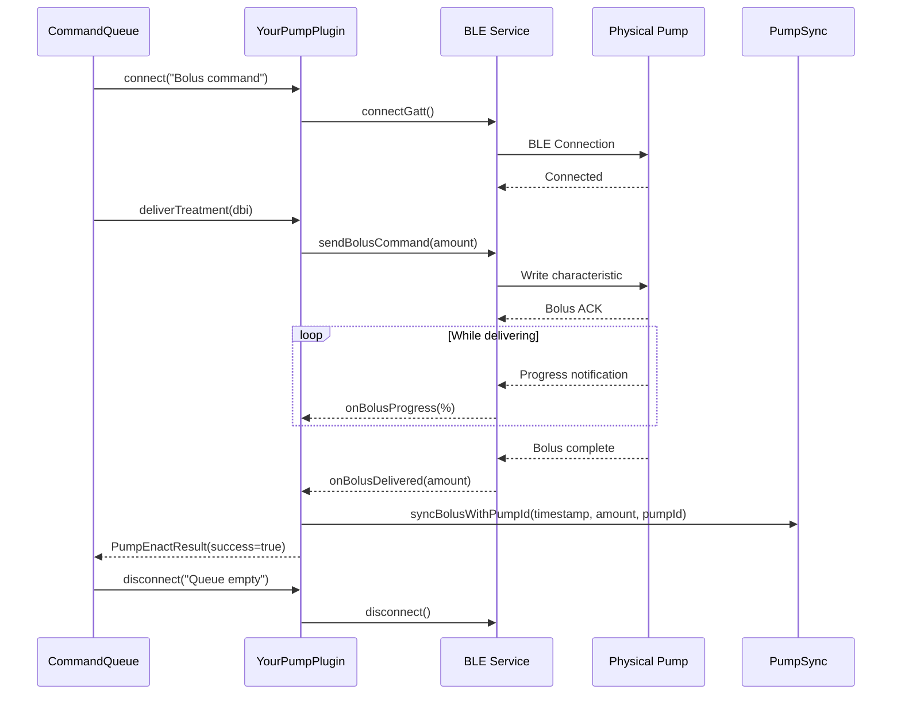

# AndroidAPS Plugin Development Guide

> How to create, register, and test plugins in the AndroidAPS architecture.

## Table of Contents

- [Plugin Overview](#plugin-overview)
- [Creating a New Plugin](#creating-a-new-plugin)
- [Plugin Registration](#plugin-registration)
- [Plugin Types Reference](#plugin-types-reference)
- [Implementing a Pump Driver](#implementing-a-pump-driver)
- [Implementing a BG Source](#implementing-a-bg-source)
- [Implementing an APS Plugin](#implementing-an-aps-plugin)
- [Adding Constraints](#adding-constraints)
- [Testing Plugins](#testing-plugins)

---

## Plugin Overview

Every feature in AndroidAPS is implemented as a plugin. Plugins:

1. Extend `PluginBase` (or `PluginBaseWithPreferences`, `PumpPluginBase`)
2. Are registered via Dagger DI modules
3. Have a lifecycle (`NOT_INITIALIZED` → `ENABLED` / `DISABLED`)
4. Can optionally provide a UI fragment and preferences screen
5. Can implement `PluginConstraints` to add safety limits



## Creating a New Plugin

### Step 1: Create the Module

```
plugins/your-plugin/
├── build.gradle.kts
└── src/
    ├── main/
    │   ├── kotlin/app/aaps/plugins/yourplugin/
    │   │   ├── YourPlugin.kt
    │   │   └── di/
    │   │       └── YourPluginModule.kt
    │   └── res/
    │       └── xml/
    │           └── pref_your_plugin.xml    # Optional preferences
    └── test/
        └── kotlin/
            └── YourPluginTest.kt
```

### Step 2: Define the Plugin Class

```kotlin
@Singleton
class YourPlugin @Inject constructor(
    aapsLogger: AAPSLogger,
    rh: ResourceHelper,
    private val rxBus: RxBus,
    private val persistenceLayer: PersistenceLayer
) : PluginBase(
    PluginDescription()
        .mainType(PluginType.GENERAL)          // Set your plugin type
        .fragmentClass(YourFragment::class.java.name)  // Optional UI
        .pluginIcon(R.drawable.ic_your_icon)
        .pluginName(R.string.your_plugin_name)
        .shortName(R.string.your_plugin_short)
        .description(R.string.your_plugin_desc)
        .preferencesId(R.xml.pref_your_plugin) // Optional prefs
        .setDefault(false),
    aapsLogger, rh
) {

    override fun onStart() {
        super.onStart()
        // Initialize resources, subscribe to events
    }

    override fun onStop() {
        super.onStop()
        // Clean up resources, unsubscribe
    }
}
```

### Step 3: Create the Dagger Module

```kotlin
@Module
@Suppress("unused")
abstract class YourPluginModule {

    @ContributesAndroidInjector
    abstract fun contributesYourFragment(): YourFragment

    companion object {
        @Provides
        @Singleton
        fun provideYourPlugin(/* dependencies */): YourPlugin {
            // Or use @Binds if binding to an interface
        }
    }
}
```

### Step 4: Register in settings.gradle

```groovy
include ':plugins:your-plugin'
```

### Step 5: Add to AppComponent

```kotlin
// In app/src/main/kotlin/app/aaps/di/AppComponent.kt
@Component(modules = [
    // ... existing modules ...
    YourPluginModule::class,
])
interface AppComponent : AndroidInjector<MainApp>
```

### Step 6: Register in PluginsListModule

```kotlin
// In app/src/main/kotlin/app/aaps/di/PluginsListModule.kt
@Provides
fun providePluginsList(
    // ... existing plugins ...
    yourPlugin: YourPlugin,
): List<@JvmSuppressWildcards PluginBase> {
    return listOf(
        // ... existing plugins ...
        yourPlugin,
    )
}
```

## Plugin Registration



## Plugin Types Reference

### APS Plugin

Implement `APS` interface:

```kotlin
class YourAPSPlugin : PluginBase(...), APS {
    override val algorithm: APSResult.Algorithm = APSResult.Algorithm.YOUR_ALG

    override fun invoke(initiator: String, tempBasalFallback: Boolean) {
        // 1. Get glucose status
        // 2. Get IOB/COB data
        // 3. Run your algorithm
        // 4. Store result in lastAPSResult
    }

    override val lastAPSResult: APSResult? = null
    override val lastAPSRun: Long = 0
}
```

### Pump Driver

Extend `PumpPluginBase` and implement `Pump`:

```kotlin
class YourPumpPlugin : PumpPluginBase(...), Pump {
    override fun isInitialized(): Boolean = /* BT connected + status read */
    override fun isConnected(): Boolean = /* BT connected */
    override fun connect(reason: String) { /* BT connect */ }
    override fun disconnect(reason: String) { /* BT disconnect */ }
    override fun getPumpStatus(reason: String) { /* Read pump state */ }

    override fun deliverTreatment(detailedBolusInfo: DetailedBolusInfo): PumpEnactResult {
        // Send bolus command to pump via BLE
        // Store result via pumpSync
    }

    override fun setTempBasalAbsolute(...): PumpEnactResult {
        // Send TBR command to pump
    }

    override fun cancelTempBasal(enforceNew: Boolean): PumpEnactResult {
        // Cancel TBR on pump
    }

    // ... implement remaining Pump interface methods
}
```

### BG Source

Implement `BgSource` interface:

```kotlin
class YourSourcePlugin : PluginBase(...), BgSource {
    override fun advancedFilteringSupported(): Boolean = false
    override val sensorBatteryLevel: Int = -1

    // BG values are typically received via BroadcastReceiver
    // and stored to database via PersistenceLayer
}
```

## Implementing a Pump Driver

### Pump Communication Flow



### PumpSync Usage

Pump drivers must use `PumpSync` to report data back to AAPS:

```kotlin
// After delivering a bolus
pumpSync.syncBolusWithPumpId(
    timestamp = System.currentTimeMillis(),
    amount = deliveredAmount,
    type = BS.Type.NORMAL,
    pumpId = pumpHistoryId,
    pumpType = PumpType.YOUR_PUMP,
    pumpSerial = serialNumber()
)

// After setting a TBR
pumpSync.syncTemporaryBasalWithPumpId(
    timestamp = System.currentTimeMillis(),
    rate = absoluteRate,
    duration = T.mins(durationMinutes.toLong()).msecs(),
    isAbsolute = true,
    type = PumpSync.TemporaryBasalType.NORMAL,
    pumpId = pumpHistoryId,
    pumpType = PumpType.YOUR_PUMP,
    pumpSerial = serialNumber()
)
```

## Adding Constraints

Any plugin can add safety constraints by implementing `PluginConstraints`:

```kotlin
class YourPlugin : PluginBase(...), PluginConstraints {

    override fun applyBasalConstraints(
        absoluteRate: Constraint<Double>,
        profile: Profile
    ): Constraint<Double> {
        // Example: limit max basal to 5 U/h
        absoluteRate.setIfSmaller(5.0, "YourPlugin: max basal limit", this)
        return absoluteRate
    }

    override fun applyBolusConstraints(
        insulin: Constraint<Double>
    ): Constraint<Double> {
        // Example: limit max bolus to 10 U
        insulin.setIfSmaller(10.0, "YourPlugin: max bolus limit", this)
        return insulin
    }

    override fun isClosedLoopAllowed(
        value: Constraint<Boolean>
    ): Constraint<Boolean> {
        // Example: require condition for closed loop
        if (!someConditionMet) {
            value.set(false, "YourPlugin: condition not met", this)
        }
        return value
    }
}
```

## Testing Plugins

### Base Test Setup

```kotlin
class YourPluginTest : TestBase() {

    @Mock lateinit var rh: ResourceHelper
    @Mock lateinit var rxBus: RxBus
    @Mock lateinit var persistenceLayer: PersistenceLayer

    private lateinit var plugin: YourPlugin

    @BeforeEach
    fun setup() {
        plugin = YourPlugin(aapsLogger, rh, rxBus, persistenceLayer)
    }

    @Test
    fun `plugin should be disabled by default`() {
        assertFalse(plugin.isEnabled())
    }

    @Test
    fun `plugin should handle enable lifecycle`() {
        plugin.setPluginEnabledBlocking(PluginType.GENERAL, true)
        assertTrue(plugin.isEnabled())
    }
}
```

### Testing with Profiles

```kotlin
class YourAPSPluginTest : TestBaseWithProfile() {

    @Test
    fun `algorithm should calculate correct rate`() {
        // TestBaseWithProfile provides:
        // - validProfile
        // - profileFunction mock
        // - dateUtil
        // Use these for testing APS calculations
    }
}
```

### Key Test Utilities

| Class | Location | Purpose |
|-------|----------|---------|
| `TestBase` | `shared/tests/` | JUnit 5 + Mockito setup, logger mock |
| `TestBaseWithProfile` | `shared/tests/` | Profile mocks for algorithm tests |
| `SharedPreferencesMock` | `shared/tests/` | In-memory SharedPreferences |
| `TestPumpPlugin` | `shared/tests/` | Fake pump for integration tests |
| `BundleMock` | `shared/tests/` | Mock Android Bundle |
