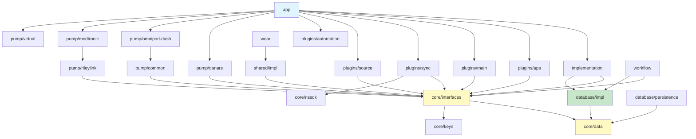
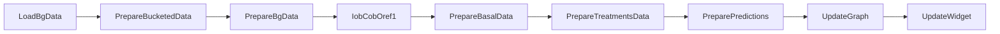

# AndroidAPS Project Structure

> Complete module-by-module breakdown of the AndroidAPS codebase.

## Table of Contents

- [Module Map](#module-map)
- [Module Dependency Graph](#module-dependency-graph)
- [Module Details](#module-details)
- [Source Code Layout](#source-code-layout)
- [Configuration Files](#configuration-files)

---

## Module Map

```
AndroidAPS/
├── app/                          # Main Android application entry point
├── core/                         # Core abstractions and shared code
│   ├── data/                     #   Data models (GV, BS, TB, CA, etc.)
│   ├── graph/                    #   GraphView for BG visualization
│   ├── interfaces/               #   Interface contracts for all plugin types
│   ├── keys/                     #   Preference key definitions
│   ├── libraries/                #   Custom library integrations
│   ├── nssdk/                    #   Nightscout SDK (REST client)
│   ├── objects/                  #   Core object implementations
│   ├── ui/                       #   Shared Compose/XML UI components
│   ├── utils/                    #   Utility functions (DateUtil, etc.)
│   └── validators/               #   Input validation
├── database/                     # Persistence layer
│   ├── impl/                     #   Room DB, DAOs, entities, migrations
│   └── persistence/              #   PersistenceLayer interface
├── implementation/               # Core interface implementations
├── plugins/                      # Feature plugins
│   ├── aps/                      #   APS algorithms (SMB, AMA, AutoISF)
│   ├── automation/               #   Rule-based automation engine
│   ├── configuration/            #   App configuration & setup wizard
│   ├── constraints/              #   Safety constraint plugins
│   ├── insulin/                  #   Insulin absorption curve models
│   ├── main/                     #   Core plugins (profiles, overview)
│   ├── sensitivity/              #   Autosens/sensitivity algorithms
│   ├── smoothing/                #   BG data smoothing
│   ├── source/                   #   CGM data source plugins
│   └── sync/                     #   Cloud sync (NS, Tidepool, xDrip+)
├── pump/                         # Insulin pump drivers
│   ├── combov2/                  #   Roche Accu-Chek Combo V2
│   ├── common/                   #   Shared pump utilities
│   ├── dana/                     #   Dana pump shared code
│   ├── danars/                   #   Dana RS/i BLE driver
│   ├── diaconn/                  #   DiaConn G8 driver
│   ├── eopatch/                  #   EOPatch driver
│   ├── equil/                    #   Equil pump driver
│   ├── insight/                  #   Insight pump driver
│   ├── medtronic/                #   Medtronic pump driver
│   ├── medtrum/                  #   Medtrum pump driver
│   ├── omnipod-common/           #   Shared Omnipod code
│   ├── omnipod-dash/             #   Omnipod DASH BLE driver
│   ├── omnipod-eros/             #   Omnipod Eros (RileyLink) driver
│   ├── rileylink/                #   RileyLink communication layer
│   └── virtual/                  #   Virtual pump for testing
├── shared/                       # Shared implementations
│   ├── impl/                     #   Logger, RxBus, SharedPreferences
│   └── tests/                    #   Base test classes and mocks
├── ui/                           # Shared UI activities and services
├── wear/                         # Wear OS companion app
├── workflow/                     # Background calculation pipeline
├── benchmark/                    # Performance benchmarks
├── buildSrc/                     # Gradle build plugins
└── gradle/                       # Gradle wrapper & version catalog
```

## Module Dependency Graph



## Module Details

### `/app` — Main Application

| Component | Path | Purpose |
|-----------|------|---------|
| `MainApp.kt` | `src/main/kotlin/app/aaps/` | Dagger application bootstrap |
| `MainActivity.kt` | `src/main/kotlin/app/aaps/` | Primary tab-based UI |
| `AppComponent.kt` | `src/main/kotlin/app/aaps/di/` | Root Dagger component |
| `AppModule.kt` | `src/main/kotlin/app/aaps/di/` | Core DI bindings |
| `PluginsListModule.kt` | `src/main/kotlin/app/aaps/di/` | Plugin registration |
| Receivers | `src/main/kotlin/app/aaps/receivers/` | System event receivers |

### `/core/interfaces` — Contract Definitions

The most important module — defines all interfaces that plugins implement.

| Interface | File | Purpose |
|-----------|------|---------|
| `Pump` | `pump/Pump.kt` | Pump driver contract |
| `PumpSync` | `pump/PumpSync.kt` | Pump → AAPS data sync |
| `APS` | `aps/APS.kt` | APS algorithm contract |
| `Loop` | `aps/Loop.kt` | Loop coordinator contract |
| `BgSource` | `source/BgSource.kt` | CGM source contract |
| `Insulin` | `insulin/Insulin.kt` | Insulin model contract |
| `Sensitivity` | `aps/Sensitivity.kt` | Sensitivity calculation |
| `PluginBase` | `plugin/PluginBase.kt` | Base class for all plugins |
| `ActivePlugin` | `plugin/ActivePlugin.kt` | Active plugin registry |
| `CommandQueue` | `queue/CommandQueue.kt` | Pump command serialization |
| `IobCobCalculator` | `iob/IobCobCalculator.kt` | IOB/COB computation |
| `PluginConstraints` | `constraints/PluginConstraints.kt` | Safety constraint chain |
| `RxBus` | `rx/bus/RxBus.kt` | Event bus interface |
| `PersistenceLayer` | `db/PersistenceLayer.kt` | Database operations |

### `/core/data` — Data Models

Compact data classes used throughout the system:

| Model | Abbreviation | Purpose |
|-------|-------------|---------|
| `GV` | GlucoseValue | Blood glucose reading |
| `BS` | Bolus | Insulin bolus record |
| `TB` | TemporaryBasal | Temp basal rate record |
| `EB` | ExtendedBolus | Extended bolus record |
| `CA` | Carbs | Carbohydrate entry |
| `TT` | TempTarget | Temporary glucose target |
| `TE` | TherapyEvent | Sensor/site change events |
| `PS` | ProfileSwitch | Profile change record |
| `RM` | RunningMode | Loop mode record |
| `UE` | UserEntry | Audit trail entry |
| `TDD` | TotalDailyDose | Daily insulin totals |

### `/database/impl` — Room Database

- **Version**: 31 (with migrations from v20)
- **Entities**: 20+ tables matching core data models
- **DAOs**: Interface-based with RxJava3 return types
- **Delegated DAOs**: Abstraction layer for change tracking
- **Repository**: `AppRepository` with reactive queries and transaction support

### `/plugins/aps` — APS Algorithms

| Plugin | File | Description |
|--------|------|-------------|
| OpenAPS AMA | `openAPSAMA/` | Advanced Meal Assist |
| OpenAPS SMB | `openAPSSMB/` | Super Micro Bolus (default) |
| AutoISF | (dynamic ISF variant) | Dynamic insulin sensitivity |
| Autotune | `autotune/` | Profile auto-tuning |
| LoopPlugin | `loop/LoopPlugin.kt` | Main loop orchestrator |

### `/pump/*` — Pump Drivers

Each pump module follows this structure:

```
pump/<name>/
├── src/main/kotlin/
│   ├── <Name>Plugin.kt          # Main plugin class
│   ├── di/                       # Dagger module
│   ├── comm/                     # BLE/serial communication
│   ├── data/                     # Pump-specific data models
│   └── services/                 # Background services
└── src/test/kotlin/              # Unit tests
```

### `/workflow` — Calculation Pipeline

Background computation via AndroidX WorkManager:



## Source Code Layout

Every module follows the standard Android/Kotlin layout:

```
module/
├── build.gradle.kts              # Module build config
└── src/
    ├── main/
    │   ├── kotlin/               # Kotlin source code
    │   │   └── app/aaps/...      # Package hierarchy
    │   ├── res/                   # Android resources
    │   └── AndroidManifest.xml   # Module manifest
    ├── test/
    │   └── kotlin/               # Unit tests (JUnit 5)
    └── androidTest/
        └── kotlin/               # Instrumentation tests
```

## Configuration Files

| File | Purpose |
|------|---------|
| `settings.gradle` | Lists all 49 modules |
| `build.gradle.kts` (root) | Root build config, Kotlin/Dagger/Firebase plugins |
| `gradle/libs.versions.toml` | Centralized dependency versions |
| `gradle.properties` | JVM settings (8GB heap, 12 workers) |
| `buildSrc/` | Custom Gradle plugins for dependency management |
| `.circleci/config.yml` | CI/CD pipeline configuration |
